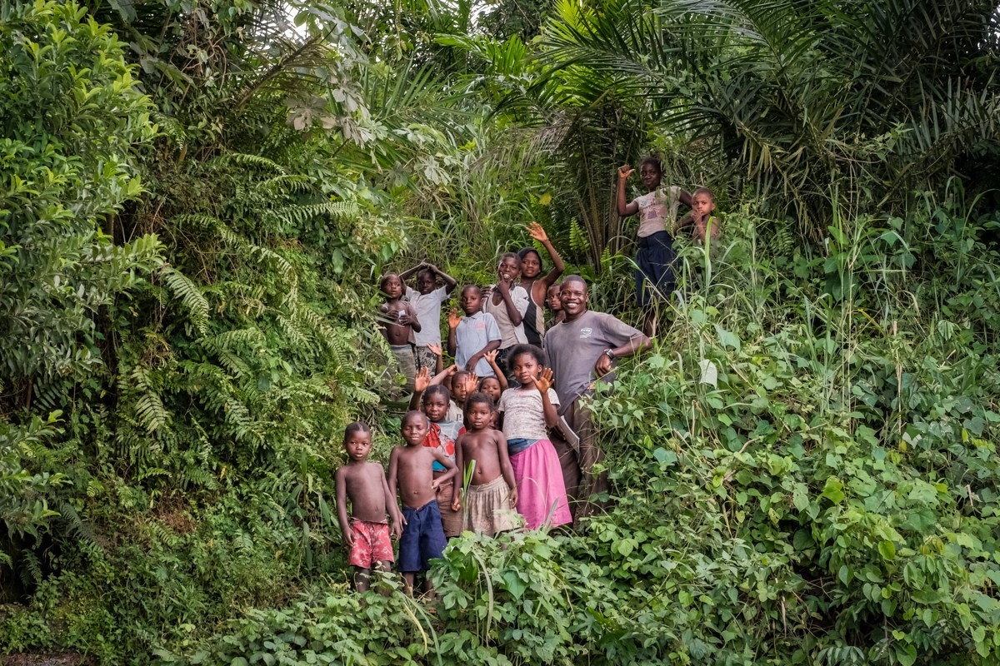

```{r setup, include=FALSE}
knitr::opts_chunk$set(echo = FALSE)

library(leaflet)
library(collapsibleTree)
library(tigris)
library(sf)
library(tmap)
library(janitor)
library(raster)
library(dplyr)
library(tidyverse)
library(here)
library(postcards)
```

## Community Based Forest Management

In the Sud Kivu  province of the Democratic Republic of Congo, development of agriculture and infrastructure has fractured viable wildlife habitat between two critical biodiversity hotspots, Kahuzi-Biega National Park and Itombwe Nature Reserve. Separated by almost 3,000 km2, these protected areas contain two of the remaining populations of the critically endangered Grauer’s gorilla. The communities that reside within the unprotected landscape between the parks depend on natural resources from the land for their livelihoods and subsistence. To establish wildlife connections across the landscape without infringing on local access rights, the government has passed a law permitting community-based forest management, a strategy that intentionally involves local peoples in forest management and governance.

```{r, out.width = "450px",fig.align = 'center'}

```

---

## Strong Roots' Vision

Strong Roots Congo, a local DRC NGO. is working to create a corridor of community forests that connect the Kahuzi-Biega National Park and the Itombwe Nature Reserve. Our team has conducted connectivity, socioeconomic and climate change analyses to identify high-priority conservation areas and investigate the impacts of future management plans in light of community opinions and climate change.

---

## Proposed Community Forest Boundaries

The study region is located in the eastern Democratic Republic of Congo in the Congo Basin rainforest within the Albertine Rift. Strong Roots Congo is working with local communities to designate an ecological corridor connecting Kahuzi-Biega National Park and Itombwe Nature Reserve that is made up of a network of 7 community forests. Strong Roots is also designating an additional 5 sections adjacent to the community forests as reforestation zones. The two protected areas, individual community forests, and reforestation zones can all be explored on the map below.


```{r}
region <- read_sf(here("study_region"), layer = "study_region_merge") %>%
  clean_names() %>%
  dplyr::select(objectid, shape_leng,type, fid_corrid) %>%
  mutate(area_type = ifelse(shape_leng > 480000,
                            1, ifelse(fid_corrid < 0,
                                      2, ifelse(objectid >0,
                                                3,4))))
IT <- region %>% 
  filter(area_type == 1) %>% 
  mutate(objectid == "Itombwe Nature Reserve")

RZ <- region %>% 
  filter(area_type == 2) %>% 
  mutate(objectid == "Reforestation Zone")

CF <- region %>% 
  filter(area_type == 3) %>% 
  mutate(objectid = ifelse(objectid == 1,
                           "Itombwe", ifelse(objectid == 3,
                                             "Ngweshe", ifelse(objectid == 6,
                                                        "Luindi", ifelse(objectid == 7,
                                                                   "Burhinyi", ifelse(objectid == 8,
                                                                              "Bakisi", ifelse(objectid == 11,
                                                                                         "Basile", "Wamuzimu")))))))

KB <- region %>% 
  filter(area_type == 4) %>% 
  mutate(objectid == "Kahuzi-Biega National Park")

cf_color <- c("forestgreen")
rz_color <- c("yellowgreen")
kb_color <- c("wheat1")
it_color <- c("wheat1")

tmap_mode("view")

tm_shape(CF, name = "Community Forests") +
  tm_borders("black")+
  tm_fill("area_type", legend.show = FALSE, palette = cf_color)+
tm_shape(RZ, name = "Reforestation Zones") +
  tm_borders("black")+
  tm_fill("area_type", legend.show = FALSE, palette = rz_color)+
tm_shape(KB, name = "Kahuzi-Biega National Park") +
  tm_borders("black")+
  tm_fill("area_type", legend.show = FALSE, palette = kb_color)+
tm_shape(IT, name = "Itombwe Nature Reserve") +
  tm_borders("black")+
  tm_fill("area_type", legend.show = FALSE, palette = it_color)+
tmap_options(basemaps = "Esri.WorldTopoMap")+
  tm_polygons("area_type", alpha = 0.5, legend.show = FALSE)

```

**Map Exploration:** The layers icon (under the plus/minus zoom buttons) can be used to remove unwanted polygons. National Parks and Nature Reserves are visualized by tan coloration. Reforestation Zones appear as light green polygons. And Community Forests are visualized in dark green. It is important to note that differences in chiefdom managers of community forests are not distinguished visually. To explore these aspects of community forestry, users can hover over shapes on the map to identify them. 