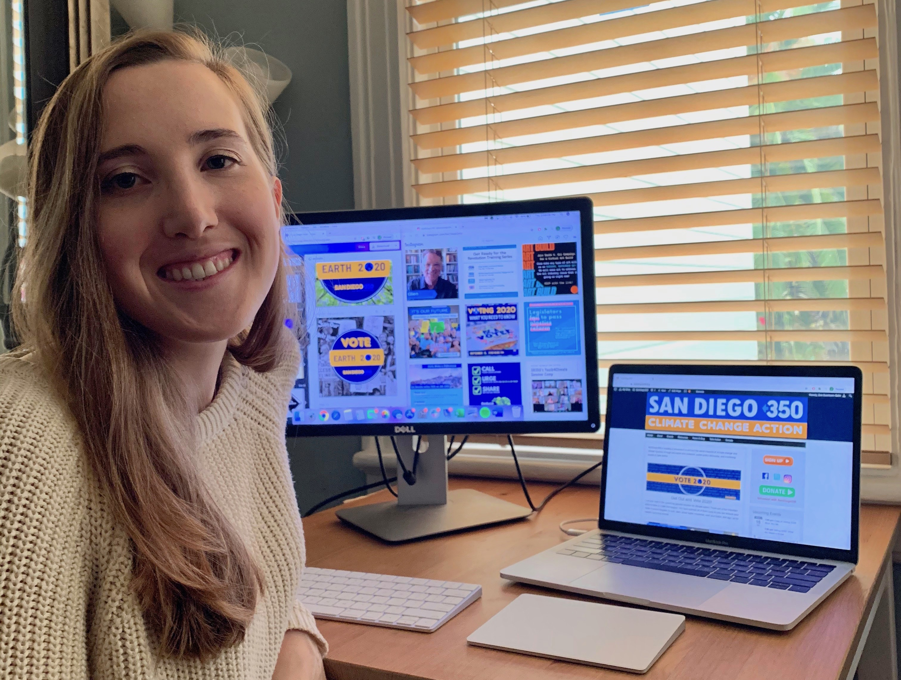

```{r setup, include=FALSE}
knitr::opts_chunk$set(echo = FALSE)
```


```{r, out.width = "500px",fig.align = 'center'}

```
##### *This month, we have decided to feature our departing Communications and Social Media Intern, Zoe Duerksen-Salm. She is a dedicated climate activist and Master’s student at the UCSB Bren School of Environmental Science and Management.*

### **SD350: How did you get involved with SD350 and when was that?**

**Zoe:** I started working with SanDiego350 in May 2020 as the Communications & Social Media Intern. My mom, Susan Duerksen, had been volunteering with SD350 for years, and would always talk about the amazing work and people that make up this organization.

When I returned to grad school and my internship ended in September, volunteering wasn’t really a question for me; it was just a given. For the foreseeable future I will be volunteering with SD350’s new Marketing & Communications volunteer team!


### **SD350: On that note, why do you believe that communications work is crucial for your climate science studies?**

**Zoe:** Research and science are imperative to our understanding of global processes—both biological and socioeconomic—but when scientific findings are not communicated properly, successful climate action is hindered.

Different audience members require different comms strategies, from lobbying politicians to vote against big oil to influencing local communities to mobilize, to notifying media outlets about volunteer work; each will require a different comms strategy. In the end, I believe that a climate mitigation solution is only as effective as your ability to communicate it.


### **SD350: What drives your activism?**

**Zoe:** As a scientist I am driven by the degradation of our global ecosystems and the exponential biodiversity loss we face. As an activist I am driven by injustice. Our system is broken, with the elites creating environmental hazards that are felt by our low-income communities and our communities of color, rather than the polluters themselves.

Climate change is the number one threat to almost all species on earth, and slowing our carbon emissions is not enough, we must mobilize against the big-oil and fossil fuel industries to stop all new coal, oil and gas projects and build a clean energy future for our global communities and ecosystems.


### **SD350: What do you recommend that people can do to maximize voting efforts this election?**

**Zoe:** Step 1 - Vote! We must elect climate-forward representatives who are committed to mitigating climate change and climate injustice. Step 2 - Get friends and family to vote! Commit to convincing at least three friends and family members, who were previously unregistered or undecided, to vote.

Your accountability makes a difference. Step 3 - Get strangers to vote! Write postcards to undecided voters, join phone banking and text campaigns for politicians who support the climate movement, attend protests and rallies against environmental injustice, and so much more!


### **SD350: What else would you like people to know about you?**

**Zoe:** Although I have always prioritized environmental justice and conservation in my studies and my activism, my personal climate action journey started quite recently. It’s never too late to join the climate movement! Everyone has something to contribute to mitigating climate change and injustice. Visit SanDiego350.org to take action! 