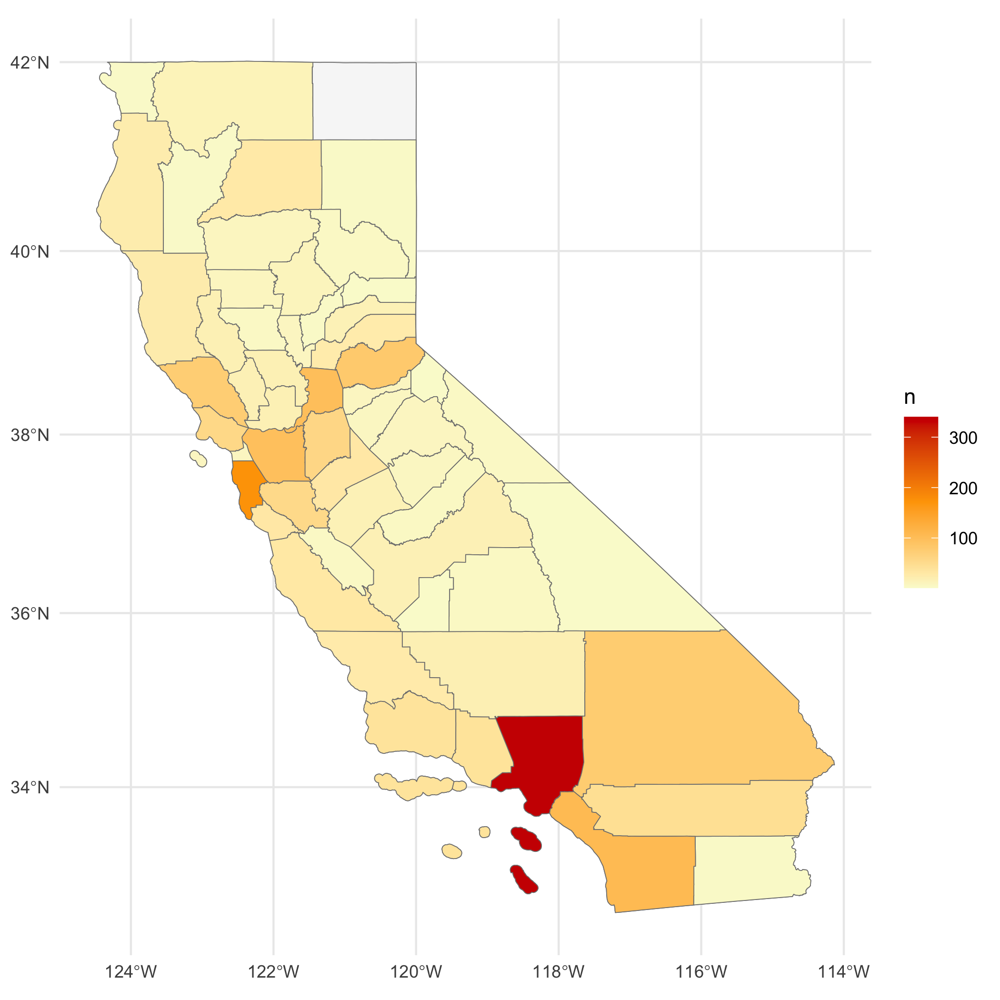

```{r setup, include=FALSE, messae=FALSE, warnings=FALSE}
knitr::opts_chunk$set(echo = FALSE)
library(here)
library(broom)
library(janitor)
library(sf)
library(tmap)
library(tidyverse)
```

# Chloropleth Map

### California Inland Oil Spill Events in 2008
```{r, out.width = "500px",fig.align = 'center'}

```
**Total counts for oil spill events in inland California for the year 2008** visualized as a static chloropleth map. Total counts were calculated by county and are shown with color. Higher counts are visualized as darker colors, lighter colors show lower counts.

```{r}
# Read in data from CA DFW Oil Spill Incident Tracking
osi_track <- read_sf(here("data","OSI_tracking","OSI_tracking.shp")) %>% 
  clean_names()

# Read in CA County shapefile data from the US Census Bureau
ca_counties <- read_sf(here("data","ca_counties","CA_Counties_TIGER2016.shp")) %>% 
  clean_names()

# Subset CA county shapefile data to include necessary variables
ca_subset <- ca_counties %>% 
  select(name, aland) %>% 
  rename(county_name = name, land_area = aland)

# Rename `inlandmari` variable for visualization purposes
osi_subset <- osi_track %>% 
  rename("Incident Location" = inlandmari)
```

---

# Interactive Map

```{r}
# Set up tmap parameters
tmap_mode(mode = "view")
```

### California Inland & Marine Oil Spill Location
```{r}
# Create tmap
tm_shape(ca_subset, name = "test") +
  tm_borders("black", lwd = .5) +
tm_shape(osi_subset) +
  tm_dots(col = "Incident Location", scale = .6)
```
**Locations of inalnd oil spill events** included in the OSPR California data. Incident location is visualized as dots (teal for inland events and yellow for marine events).

---

# Data Source

**Oil Spill Incident Tracking [ds394] (2008).** [Digital map](https://map.dfg.ca.gov/metadata/ds0394.html). California Department of Fish and Game, Office of Spill Prevention and Response.