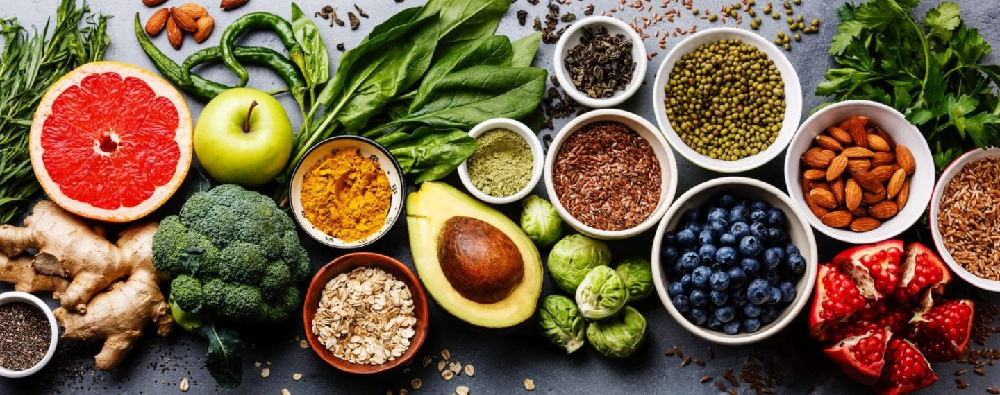

```{r setup, include=FALSE}
knitr::opts_chunk$set(echo = TRUE,
                      message = FALSE,
                      warning = FALSE)

# Attach packages
library(tidyverse)
library(janitor)
library(palmerpenguins)
library(here)
library(readxl)
library(dplyr)
library(lubridate)
library(patchwork)
library(ggfortify)
```

```{r, out.width = "750px",fig.align = 'center'}

```

## Summary of data and analysis:

The [Food Nutrient USDA dataset](https://fdc.nal.usda.gov/index.html) provides nutritional information on calories, nutrient density, and percent of daily recommendations for a wide range of food types. For the principle component analysis (PCA), I was interested analyzing the data from the point of view of a vegan concerned about obtaining critical nutrients from legumes. To do so, the data had to be refined in three ways:

1. The food category was narrowed to include only Legumes and Legume Products, a critical category of vegan protein.
2. Legumes and Legume Products was then further refined to exclude highly processed products (i.e., fake meats).
3. The analysis only considered six nutrients, all of which are commonly lacking in vegan diets (protein, calcium, iron, zinc, vitamin b6, and vitamin b12).

---

## Analysis & PCA Biplot

```{r}
# Wrangle USDA dataset so that it's ready for PCA
usda_nuts <- read_csv("usda_nutrients.csv") %>% 
  clean_names() %>%  
  filter(food_group %in% c("Legumes and Legume Products")) %>% # Filter food group to include only Legumes
  mutate(category = descrip) %>% 
  mutate(category = case_when(
    str_detect(category, "Beans") ~ "Beans",
    str_detect(category, "beans") ~ "Beans",
    str_detect(category, "Hummus") ~ "Beans",
    str_detect(category, "Falafel") ~ "Beans",
    str_detect(category, "Soy") ~ "Soy",
    str_detect(category, "soy") ~ "Soy",
    str_detect(category, "Tofu") ~ "Soy",
    str_detect(category, "SILK") ~ "Soy",
    str_detect(category, "Peas") ~ "Peas",
    str_detect(category, "Pea") ~ "Peas",
    str_detect(category, "pea") ~ "Peas",
    str_detect(category, "peas") ~ "Peas",
    str_detect(category, "Lentils") ~ "Lentils",
    str_detect(category, "Seed") ~ "Seeds",
    str_detect(category, "Seeds") ~ "Seeds",
    str_detect(category, "seed") ~ "Seeds",
    str_detect(category, "Tempeh") ~ "Tempeh",
    TRUE ~ category)
    ) %>% # Create a new column to categorize foods as beans, soy, peas, lentils, seeds, and tempeh
  filter(category %in% c("Beans","Soy","Peas","Lentils","Seeds","Tempeh")) 
# Use filter again to exclude any observations that do not fulfill these requirements (i.e., processed meats)


# Create new df and run PCA
usda_nuts_pca <- usda_nuts %>% 
  select(protein_g, calcium_mg, iron_mg, zinc_mg, vit_b6_mg, vit_b12_mcg) %>%
  drop_na() %>% #drop rows containing any NA values
  scale() %>% #scale variables
  prcomp() #run principal components

# Check/assess PCA
usda_nuts_pca$rotation

# To distinguish biplot points aesthetically, create df that include what is necessary observations for the biplot, but still contain other info
usda_nuts_complete <- usda_nuts %>% 
  drop_na(energy_kcal, ends_with("_g"), ends_with("_mg"), ends_with("_mcg"), ends_with("_usrda"))

# Create biplot using {autoplot}
autoplot(usda_nuts_pca,
         data = usda_nuts_complete,
         colour = "category",
         loadings = TRUE,
         loadings.label = TRUE,
         loadings.label.size = 3,
         loadings.colour = 'grey30',
         loadings.label.colour = 'black',
         loadings.label.vjust = -0.45,
         loadings.label.hjust = 0.75)+
  labs(title = "PCA: Legume Nutrition")+
  theme_minimal()
```
---

## PCA biplot takeaways

### Interpreting biplot eigenvalue correlations 
The biplot shows two primary instances of positive correlations.

* **Zinc and vitamin b6 are positively correlated:** This finding is somewhat surprising, as there seems to be no prior published research on a correlation between this mineral and vitamin. Perhaps this would be a good line of study for future nutritional studies.
* **Iron and protein are positively correlated:** The nutritional literature has long identified beans (especially garbanzos) as great sources of vegan protein and iron. Therefore this finding follows common knowledge.


The biplot shows two primary instances essentially zero correlation.

* **The correlation between vitamin b12 and protein is essentially zero:** This finding was somewhat surprising as vitamin b12 is often highly correlated with animal protein. Therefore, it is interesting that this trend is not the same for plant proteins.
* **The correlation between calcium and vitamin b6 is essentially zero:** Given a lack of correlation between calcium and vitamin b6 within the scientific literature, this finding is not surprising.

The eigenvalue lines for protein, iron, zinc, and vitamin b6 all point toward low values of PC1, highlighting that lower values of PC1 indicate higher levels of these vitamins and minerals. Alternatively, calcium and vitamin b12 both point toward higher values of PC2, highlighting that higher values of PC2 indicate higher levels of these vitamins and minerals.


### Biplot observation (point) *Euclidean Distance* and outliers
In general, all categories of legume foods are clustered together. In other words, legumes are generally similar overall in multivariate space. However, there appears to be some spread and outliers among the soy and peas categories. This indicates higher variance among soy and pea legume products as compared to the other observations.