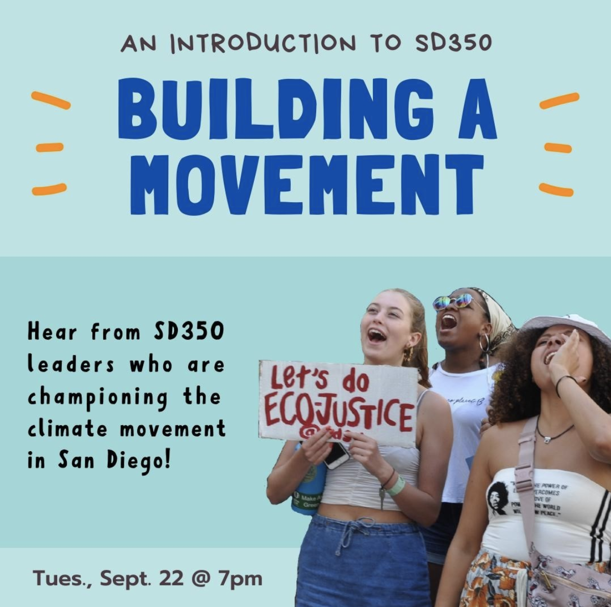
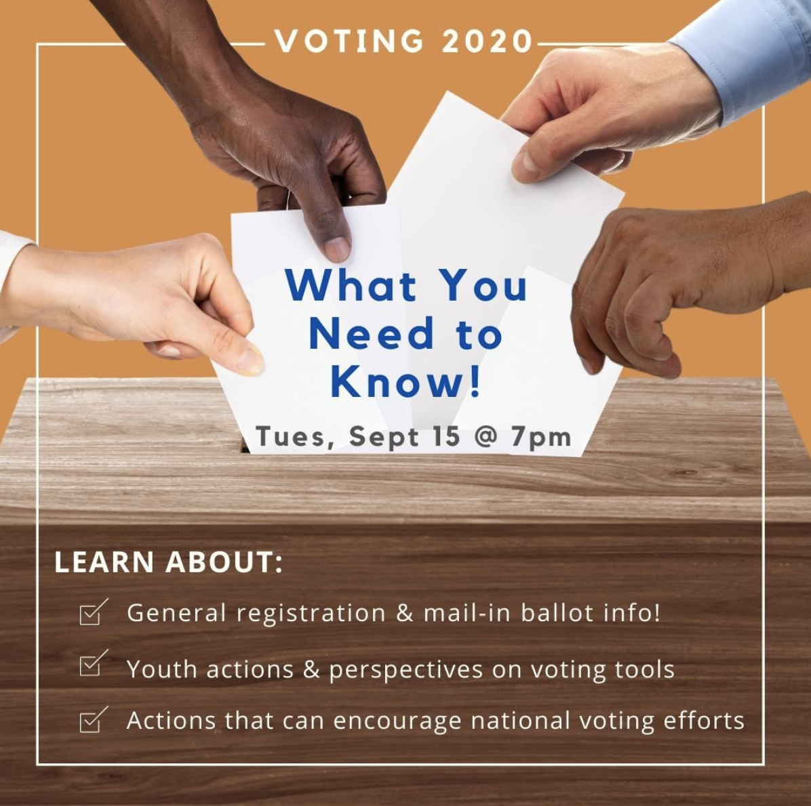
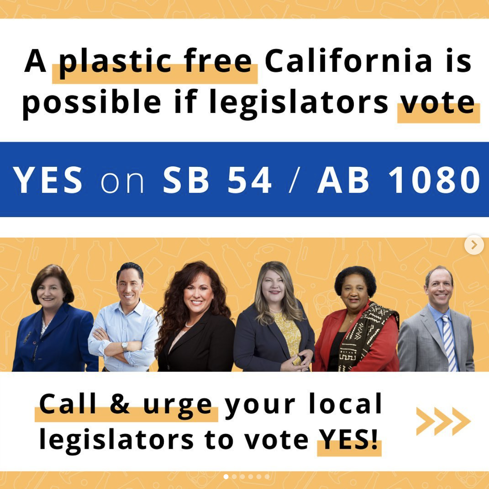
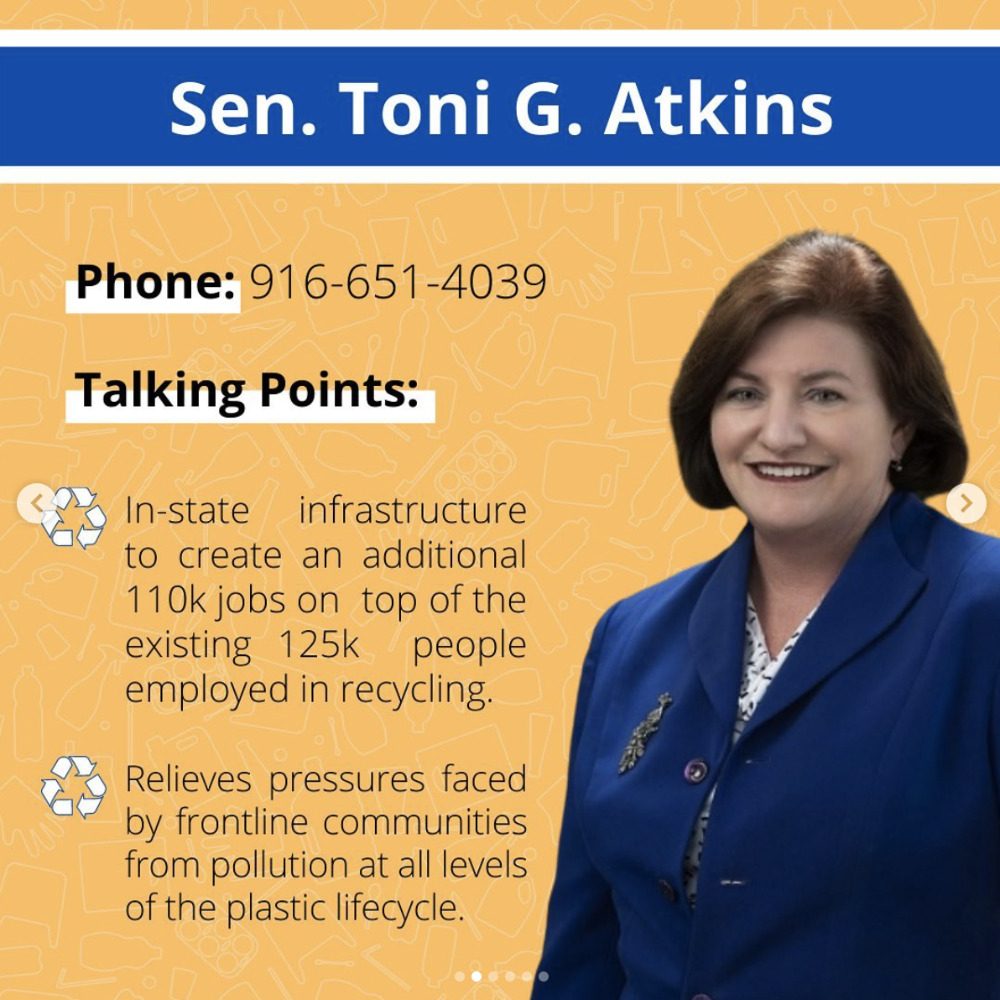
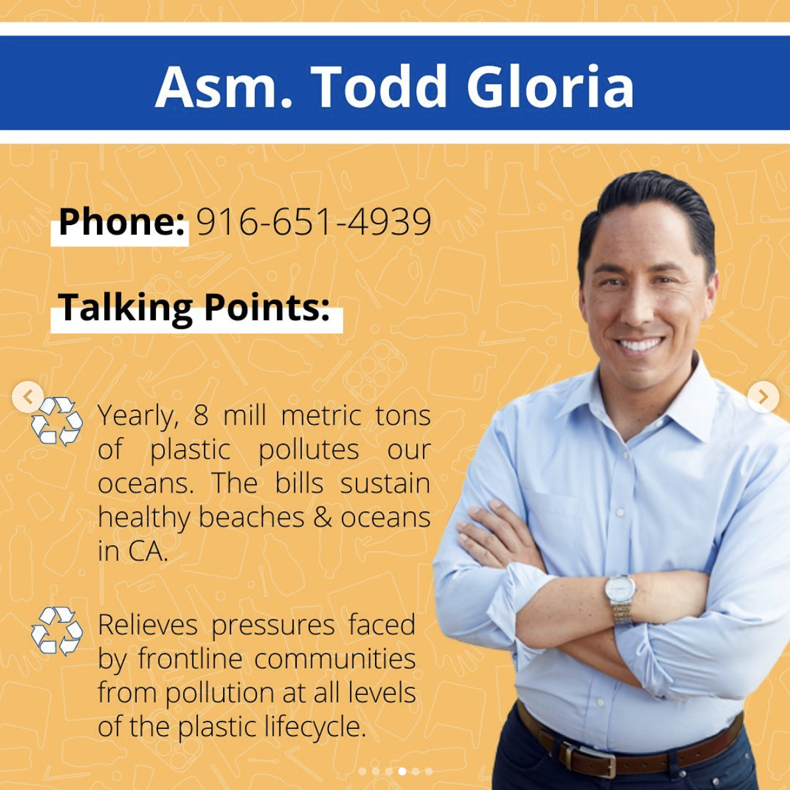
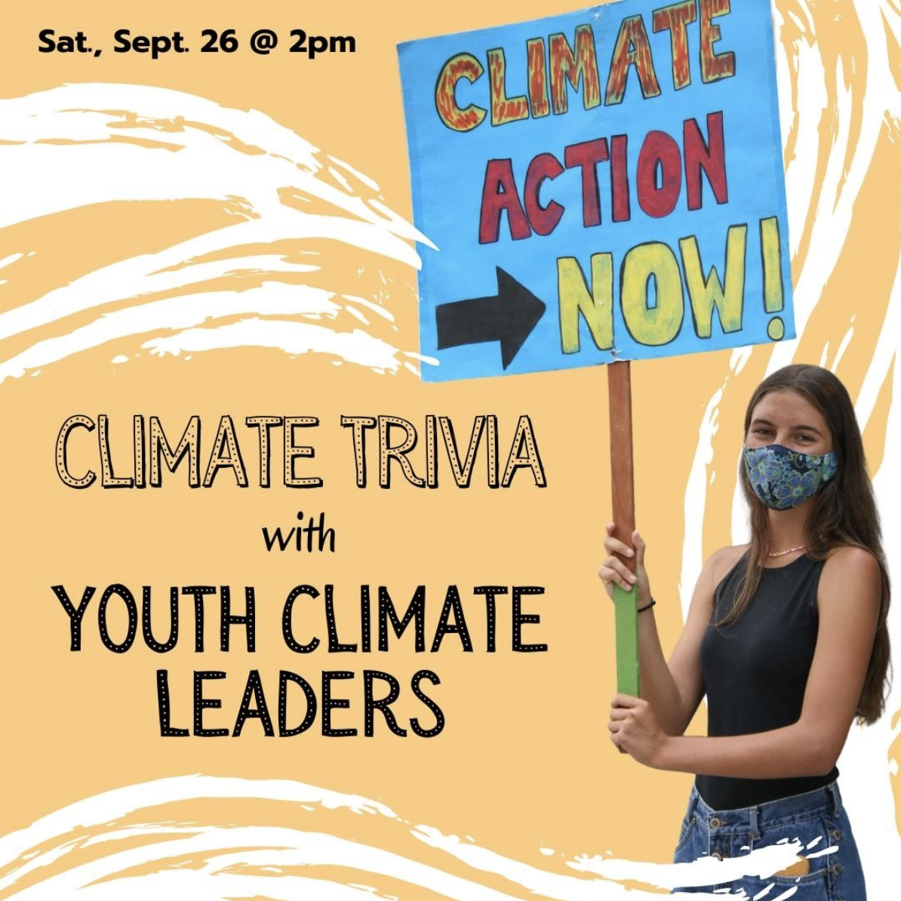
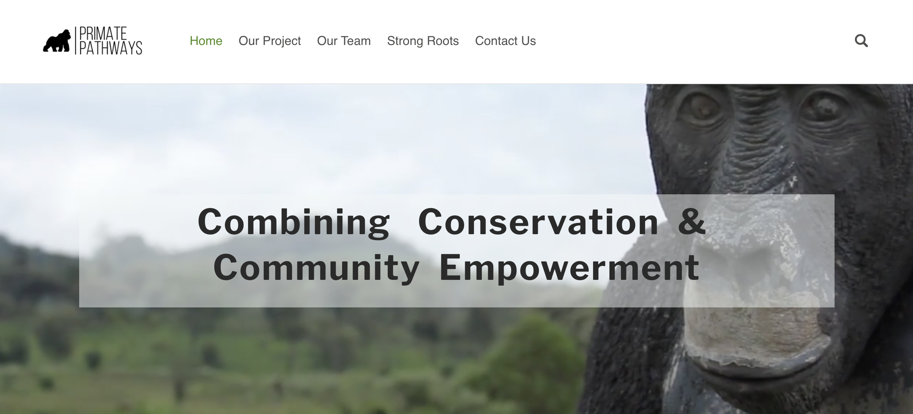
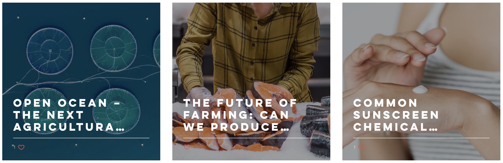
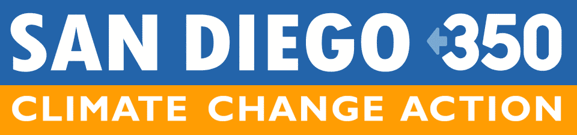

## Social Media Graphics

```{r, echo=FALSE, out.width = "400px",fig.align = 'center'}

```
Join SD350 tonight (9/22) at 7:00pm as we kick-off the It's Our Future: Celebration & Sustaining Donor drive event!

The need for action against climate change and climate injustice has never been greater. SanDiego350 is growing a climate movement in San Diego By building a resilient volunteer-led structure that provides opportunities for adults and youth to take meaningful action in a collaborative, inclusive community.

---

```{r, echo=FALSE, out.width = "400px",fig.align = 'center'}

```
Interested in what others, including teens and local community members, are doing to encourage voting efforts nationally?

Join the SD350 meeting next Tuesday, September 15 @ 7:00pm for a deep dive into overcoming obstacles of voting in 2020, tools used by fellow SD350 members, and individual actions that YOU can take to push the climate movement this November!

---

```{r, echo=FALSE, out.width = "400px",fig.align = 'center'}

```

```{r, echo=FALSE, out.width = "400px",fig.align = 'center'}

```

```{r, echo=FALSE, out.width = "400px",fig.align = 'center'}

```
ACTION ALERT: Urge your local legislators to support SB 54/AB 1080 to reduce single-use plastic packaging and products in CA by 75% 🚨

These bills need support from lawmakers to be brought to a floor vote and we NEED your help to urge 4 key representatives to support #YesonAB1080 and #YesonSB54

NOTE: it is especially critical to contact Asm. Maienschein who has not yet voiced support for the bills

❗️Toolkit in Bio❗️

---

```{r, echo=FALSE, out.width = "400px",fig.align = 'center'}

```
Today (Sept 26) @ 2 pm: Youth panel & climate trivia - Join our Youth4Climate fellows for a (virtual) panel to discuss plans for building the youth climate movement in San Diego.

We’ll also host a fun game of climate trivia 🏆 And the top 3 contestants will receive an SD350 prize bin!

Register with the link in our bio to receive the zoom link ⬆️

---

## Website Designs

**Primate Pathways Website:** Built & designed entire website.
https://primatepathways.weebly.com/

```{r, echo=FALSE, out.width = "600px",fig.align = 'center'}

```

**SD350 Website:** In process! Currently serving as project manager, connecting web developers and designers. This project in in its eleventh month of production and is projected for completion in June 2021.

---

## Blog & Newsletter Production

**Bren Comm Article Posts** Edited and formatted articles on the Bren Comm website.
https://www.brencomm.com/blog

```{r, echo=FALSE, out.width = "600px",fig.align = 'center'}

```

**SD350 Newsletter:** Collaborated on a team of two to write, edit, and design the monthly SD350 newsletter.
https://sandiego350.org/newsletter-archive/

```{r, echo=FALSE, out.width = "600px",fig.align = 'center'}

```